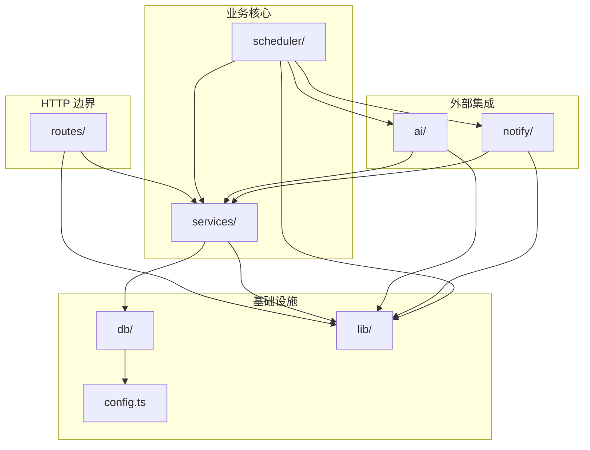

# Nudge 后端结构设计文档

> 架构师视角。基于 DESIGN.md 原则与已定数据库设计（7 表 + user_id 预留），确定后端框架与项目结构。
> 原型脚手架为 NestJS，经评估改为 **Hono**——更贴合「没有第二个实现不抽象」原则。

---

## 1. 框架选型决策（ADR）

### 1.1 决策：NestJS → Hono

**背景**：现有脚手架为 NestJS 11（`@Module`/`@Controller`/`@Injectable` + DI 容器 + 装饰器）。

**问题**：NestJS 的整套 DI/模块体系是为「复杂企业应用 + 多实现可替换 + 横切组合」设计的。Nudge 的实际依赖图是一条直线：

```
routes → services → better-sqlite3
scheduler → services + ai + notify
```

没有第二个实现需要切换、没有复杂依赖图、没有多租户。用 NestJS 等于默认背上「可替换抽象层」，与 DESIGN.md 第 9 条「没有第二个实现，不允许抽象接口」直接冲突。

**决策**：后端框架改用 **Hono**（+ `@hono/node-server` 适配 Node.js）。

### 1.2 对比依据

| 维度 | NestJS | Hono | 是否更符合原则 |
|---|---|---|---|
| 依赖注入 | DI 容器 + `@Injectable` | 无 DI，直接 import | ✓ 无可替换实现需求 |
| 代码组织 | Module/Controller/Service 三件套 + 装饰器 | 路由即函数 + 目录组织 | ✓ 回归 DESIGN.md 第 4 节扁平目录 |
| 装饰器 | 必须 `experimentalDecorators` + `reflect-metadata` | 零装饰器 | ✓ tsconfig 更简 |
| 启动开销 | 扫描模块、初始化容器 | 几乎零开销 | ✓ 单用户自托管 |
| 抽象诱导 | Guard/Pipe/Interceptor/Filter 一等公民 | 仅中间件链 | ✓ 避免为抽象而抽象 |
| 体积 | 重 | 极轻 | ✓ |

**核心**：Hono 让结构回归扁平——路由 = 函数注册，业务 = 直接操作 SQLite，所见即所得。

### 1.3 不改 Hono 的场景

若未来出现以下情况，再评估是否回到 NestJS 或引入 DI：
- 真正的 Provider 多实现（如多个搜索后端、多个 LLM 需运行时切换）。
- 复杂的横切组合（多 Guard 链、AOP 切面）。
- 多租户 + 复杂鉴权链。

当前均不成立。

---

## 2. 设计原则

对齐 DESIGN.md 第 9 条，并具体化：

1. **薄路由 + 厚 service**：routes 只做校验、调 service、序列化响应；业务逻辑全在 services。
2. **无 DI 容器**：模块间直接 import 调用，不搞 `@Injectable` / `provide`。
3. **无 Repository 抽象**：service 直接用 `better-sqlite3` 同步 API 操作 SQLite。
4. **无 Provider 接口**：`ai/`、`notify/` 是直接实现，不抽象 `ISearchProvider` / `INotifyProvider`。
5. **函数式组合**：lib 里放纯函数，service 间通过参数传递，不通过共享状态。
6. **单向依赖**：`routes → services → db`，`scheduler → services + ai + notify`，无环。

---

## 3. 技术栈

| 层 | 选型 | 说明 |
|---|---|---|
| Web 框架 | Hono ^4 | 路由即函数，零装饰器 |
| Node 适配 | `@hono/node-server` | Hono 跑在 Node.js 的适配器 |
| 数据库 | `better-sqlite3` | 同步 API，单进程最佳，无需连接池 |
| 校验 | Zod + `zod-validator` | Hono 官方校验中间件 |
| 调度 | `node-cron` | DESIGN.md 已定 |
| HTTP 客户端 | 原生 `fetch`（Node 22 内置） | 调搜索 API 与 LLM |
| 运行时 | Node.js 22 | 见 `.nvmrc` |
| 构建 | `tsc`（生产）+ `tsx`（开发热重载） | 替代 `nest build` |

---

## 4. 目录结构

```
packages/server/src/
├── main.ts                        # 入口：serve(app, port)
├── app.ts                         # Hono 实例 + 全局中间件 + 路由挂载 + initDb()
├── config.ts                      # 环境变量读取 + 常量（PORT、DB_PATH）
├── types.ts                       # 本地类型：DB Row、ApiResponse、错误码
│
├── db/
│   ├── index.ts                   # better-sqlite3 连接 + PRAGMA + 执行 init.sql
│   └── client.ts                  # 导出 db 单例 + transaction() helper
│
├── routes/                        # HTTP 路由层（薄：校验 → 调 service → 序列化）
│   ├── index.ts                   # 聚合所有子路由，挂载到 /api
│   ├── health.ts                  # GET /api/health
│   ├── interests.ts               # /api/interests CRUD + 启停 + 归档
│   ├── updates.ts                 # /api/updates 列表/筛选/标记已读
│   ├── settings.ts                # /api/settings 读写
│   └── channels.ts               # /api/notification-channels CRUD + 测试发送
│
├── services/                      # 业务逻辑（操作 DB，被 routes & scheduler 复用）
│   ├── interest.service.ts        # interest + task CRUD（1:1 一起操作）
│   ├── update.service.ts         # update 查询 + 去重写入 + 标记已读/已通知
│   ├── settings.service.ts       # settings 读写（启动时缓存到内存）
│   ├── channel.service.ts        # notification_channel CRUD + 默认渠道切换
│   └── task-run.service.ts       # task_run 写入 + 查询（执行留痕）
│
├── scheduler/
│   ├── index.ts                   # node-cron 启动 + 每分钟扫描 next_run_at
│   └── check.ts                    # 单次检查编排：取兴趣→拼查询→搜索→LLM→写update→通知
│
├── ai/
│   ├── search.ts                   # Tavily 搜索（fetch）
│   └── llm.ts                      # OpenAI 兼容 LLM 分析（fetch）
│
├── notify/
│   └── index.ts                    # 飞书/钉钉/邮件发送（按 channel.type switch 分支）
│
└── lib/
    ├── zod.ts                      # 各领域 Zod schema 复用定义
    ├── http.ts                     # jsonOk / jsonError / HTTP 状态码常量
    ├── errors.ts                   # AppError 类 + 错误类型枚举
    ├── hash.ts                     # content_hash 计算（sha256）
    └── time.ts                     # UTC 存取 + 时区转换 + next_run_at 计算
```

### 目录职责一句话

| 目录 | 职责 | 依赖方向 |
|---|---|---|
| `routes/` | HTTP 边界：解析请求、校验、调 service、返回 JSON | → services, lib |
| `services/` | 业务逻辑 + DB 操作 | → db, lib |
| `scheduler/` | 定时触发 + 检查编排 | → services, ai, notify, db |
| `ai/` | 外部搜索 + LLM | → lib, config（读 settings） |
| `notify/` | 外部通知发送 | → lib, config |
| `db/` | SQLite 连接 + init | → config |
| `lib/` | 纯函数工具 | 无依赖（仅 zod/node 内置） |
| `config.ts` | env + 常量 | 无依赖 |

---

## 5. 分层约定

### 5.1 routes/ — 薄 HTTP 层

**只做三件事**：校验入参 → 调 service → 序列化出参。

```ts
// routes/interests.ts
import { Hono } from 'hono';
import { zValidator } from '@hono/zod-validator';
import { interestService } from '../services/interest.service.js';
import { createInterestSchema } from '../lib/zod.js';
import { jsonOk } from '../lib/http.js';

export const interests = new Hono();

interests.get('/', (c) => jsonOk(c, interestService.list(c.var.userId)));
interests.post('/', zValidator('json', createInterestSchema), (c) => {
  const created = interestService.create(c.var.userId, c.req.valid('json'));
  return jsonOk(c, created, 201);
});
interests.put('/:id/toggle', (c) => {
  interestService.toggle(c.var.userId, Number(c.req.param('id')));
  return jsonOk(c, { ok: true });
});
```

**禁止**：
- 在 routes 里写 SQL。
- 在 routes 里调 ai/notify（那是 scheduler 的职责）。
- 业务判断逻辑（如「importance 是否达标」应放 service）。

### 5.2 services/ — 厚业务层

**承担全部业务逻辑 + DB 操作**。被 routes 和 scheduler 共享。

```ts
// services/interest.service.ts
import { db } from '../db/client.js';
import { hashContent } from '../lib/hash.js';
import type { InterestRow } from '../types.js';

export const interestService = {
  list(userId: number): InterestRow[] {
    return db.prepare(
      'SELECT * FROM interest WHERE user_id = ? AND status = ? ORDER BY created_at DESC'
    ).all(userId, 'active') as InterestRow[];
  },

  create(userId: number, input: CreateInterestInput): InterestRow {
    return db.transaction(() => {
      const ins = db.prepare(
        'INSERT INTO interest (user_id, name, category, description, query_keywords) VALUES (?,?,?,?,?)'
      ).run(userId, input.name, input.category, input.description, input.queryKeywords);
      // 1:1 建 task
      db.prepare(
        'INSERT INTO task (user_id, interest_id, frequency, time) VALUES (?,?,?,?)'
      ).run(userId, ins.lastInsertRowid, input.frequency, input.time);
      return this.get(userId, Number(ins.lastInsertRowid))!;
    })();
  },
  // ...
};
```

**约定**：
- 每个 service 导出一个对象（不是 class），方法即业务操作。
- 所有方法第一参数是 `userId`（从 routes 的 `c.var.userId` 传入，scheduler 传入 task 的 user_id）。
- DB 操作用 `db.prepare().run()/all()/get()` 同步 API。
- 跨表事务用 `db.transaction(() => {...})()`。

### 5.3 scheduler/ — 调度与编排

```ts
// scheduler/check.ts
import { interestService } from '../services/interest.service.js';
import { updateService } from '../services/update.service.js';
import { taskRunService } from '../services/task-run.service.js';
import { search } from '../ai/search.js';
import { analyze } from '../ai/llm.js';
import { notify } from '../notify/index.js';
import { settingsService } from '../services/settings.service.js';

export async function runCheck(taskId: number) {
  const task = interestService.getTask(taskId);
  const interest = interestService.get(task.userId, task.interest_id);
  const settings = settingsService.get(task.userId);
  const runId = taskRunService.start(task.userId, taskId, interest.id);

  try {
    const results = await search(interest, settings);       // 1. 搜索
    const updates = await analyze(interest, results, settings); // 2. LLM 分析
    const created = updateService.writeMany(task.userId, interest.id, runId, updates); // 3. 去重写入
    const toNotify = created.filter(u => u.importance >= settings.notify_threshold);
    if (toNotify.length) await notify(task.userId, toNotify); // 4. 通知
    taskRunService.succeed(runId, { count: created.length, ... });
  } catch (e) {
    taskRunService.fail(runId, e);
  }
}
```

**关键**：`check.ts` 是核心闭环的编排者，它组合 services + ai + notify，但不包含业务规则（规则在 service 内）。

### 5.4 ai/ notify/ — 外部集成

直接实现，不抽象接口。新增渠道/搜索源时改这里的 switch 分支，不引入 Provider 体系。

### 5.5 lib/ — 纯函数工具

无副作用、无 IO、无外部依赖（除 zod/node）。可被任何层调用。

---

## 6. 依赖关系图



**规则**：
- 箭头方向单向，无环。
- `lib` 与 `config` 在最底层，被所有层引用。
- `routes` 不直接调 `ai/notify/db`，只调 `services`。
- `scheduler` 是唯一编排 `ai + notify` 的入口（routes 不直接触发外部集成）。

---

## 7. 命名规范

| 项 | 规范 | 示例 |
|---|---|---|
| 目录 | 复数名词 / kebab-case | `routes/`、`notification-channels`（此处用 `channels` 简写） |
| 文件 | kebab-case | `interest.service.ts`、`task-run.service.ts` |
| service 对象 | camelCase + `.service` | `interestService`、`taskRunService` |
| route 对象 | camelCase | `interests`（Hono 实例） |
| 函数 | camelCase | `runCheck`、`hashContent` |
| 类型 | PascalCase | `InterestRow`、`CreateInterestInput` |
| Zod schema | camelCase + Schema 后缀 | `createInterestSchema` |
| 常量 | UPPER_SNAKE | `HTTP_STATUS`、`DEFAULT_THRESHOLD` |

---

## 8. 校验与错误处理

### 8.1 校验（Zod + zod-validator）

```ts
// lib/zod.ts
import { z } from 'zod';

export const createInterestSchema = z.object({
  name: z.string().min(1).max(200),
  category: z.enum(['company', 'policy', 'tech', 'game', 'finance']),
  description: z.string().optional(),
  queryKeywords: z.string().optional(),
  frequency: z.enum(['day', 'week']),
  time: z.string().regex(/^\d{2}:\d{2}$/),
});

export const updateSettingsSchema = z.object({
  aiBaseUrl: z.string().url().optional(),
  aiApiKey: z.string().optional(),
  aiModel: z.string().optional(),
  notifyThreshold: z.number().int().min(1).max(10).optional(),
  timezone: z.string().optional(),
});
```

routes 里用 `zValidator('json', schema)` 中间件，校验失败自动 400。

### 8.2 错误处理

```ts
// lib/errors.ts
export class AppError extends Error {
  constructor(
    public code: string,        // 'NOT_FOUND' | 'VALIDATION' | 'CONFLICT' | ...
    public status: number,      // HTTP 状态码
    message: string,
  ) { super(message); }
}

// app.ts
app.onError((err, c) => {
  if (err instanceof AppError) {
    return jsonError(c, err.status, err.code, err.message);
  }
  console.error(err);
  return jsonError(c, 500, 'INTERNAL', '服务器内部错误');
});
```

service 里抛 `AppError`，routes 不需要 try-catch，全局 onError 统一兜底。

---

## 9. 配置管理

分两类：

| 类别 | 存放 | 读取方式 | 示例 |
|---|---|---|---|
| 运行时配置 | 环境变量 | `config.ts` 启动时读 | `PORT`、`DB_PATH` |
| 业务配置 | DB `settings` 表 | `settings.service` 读写 | `ai_api_key`、`notify_threshold`、`timezone` |

```ts
// config.ts
export const config = {
  port: Number(process.env.PORT ?? 8787),
  dbPath: process.env.DB_PATH ?? './data/nudge.db',
  isDev: process.env.NODE_ENV !== 'production',
};
```

**settings.service 缓存策略**：启动时全量读入内存，写入时同步更新缓存。单用户低频写，缓存一致性好维护。

---

## 10. 不做的事（明确边界）

对齐 DESIGN.md，MVP 明确不做：

1. **不引入 DI 容器**——直接 import 调用。
2. **不抽象 Repository**——service 直接用 better-sqlite3。
3. **不抽象 Provider 接口**——`ai/notify` 是直接实现，不搞 `ISearchProvider`。
4. **不分 use-case / application 层**——service 一层够用。
5. **不引入 DTO 类**——用 Zod schema 推断类型 + interface。
6. **不搞 entities 目录**——DB Row 类型放 `types.ts`。
7. **不引入 ORM**——better-sqlite3 直接写 SQL。
8. **不引入日志框架**——`console` + Hono `logger()` 中间件够用。
9. **不引入测试框架**（MVP）——验证靠手动 + 健康检查。
10. **不引入 Swagger/OpenAPI**——MVP 前端契约在 `@nudge/shared` 维护。

---

## 11. 关键流程的模块协作

### 11.1 创建兴趣（POST /api/interests）

```
routes/interests.ts
  → zValidator 校验
  → interestService.create(userId, input)
       → db.transaction: INSERT interest + INSERT task (1:1)
  → jsonOk(201)
```

### 11.2 调度执行（核心闭环）

```
scheduler/index.ts (node-cron 每分钟)
  → 扫描 task WHERE enabled=1 AND next_run_at <= now
  → 对每个 task: runCheck(task.id)
       → interestService.getTask / get
       → settingsService.get
       → taskRunService.start
       → ai/search → ai/llm
       → updateService.writeMany (去重)
       → notify (若 importance >= threshold)
       → taskRunService.succeed
       → interestService.updateNextRun
```

### 11.3 Dashboard 查询（GET /api/updates?important=1）

```
routes/updates.ts
  → updateService.listImportant(userId, since=1day)
  → jsonOk
```

---

## 12. API 契约约定

| 资源 | 方法 | 路径 | 说明 |
|---|---|---|---|
| health | GET | `/api/health` | 健康检查 |
| interests | GET | `/api/interests` | 列表（active） |
| | POST | `/api/interests` | 创建（含 task 配置） |
| | GET | `/api/interests/:id` | 详情 |
| | PUT | `/api/interests/:id` | 更新 |
| | PUT | `/api/interests/:id/toggle` | 启停 |
| | DELETE | `/api/interests/:id` | 物理删除（级联） |
| | POST | `/api/interests/:id/check` | 手动触发检查 |
| updates | GET | `/api/updates` | 列表（支持 interest_id / since / importance 筛选） |
| | GET | `/api/updates/:id` | 详情 |
| | PUT | `/api/updates/:id/read` | 标记已读 |
| settings | GET | `/api/settings` | 读取 |
| | PUT | `/api/settings` | 更新 |
| channels | GET | `/api/notification-channels` | 列表 |
| | POST | `/api/notification-channels` | 创建 |
| | PUT | `/api/notification-channels/:id` | 更新 |
| | DELETE | `/api/notification-channels/:id` | 删除 |
| | POST | `/api/notification-channels/:id/test` | 测试发送 |

**响应格式**：

```ts
// 成功
{ "data": T }                    // 200
{ "data": T }                    // 201（创建）

// 失败
{ "error": { "code": string, "message": string } }  // 4xx/5xx
```

共享类型放 `packages/shared/src/types.ts`，前后端共用。

---

## 13. 迁移影响（NestJS → Hono）

### 13.1 package.json 变更

**移除**：
- `@nestjs/common`、`@nestjs/core`、`@nestjs/platform-express`
- `@nestjs/cli`、`@nestjs/schematics`
- `reflect-metadata`、`rxjs`

**新增**：
- `hono`、`@hono/node-server`
- `better-sqlite3`、`@types/better-sqlite3`
- `zod`、`@hono/zod-validator`
- `node-cron`、`@types/node-cron`
- `tsx`（dev 热重载）

**脚本变更**：
```json
{
  "scripts": {
    "dev": "tsx watch src/main.ts",
    "build": "tsc",
    "start": "node dist/main.js",
    "lint": "eslint \"src/**/*.ts\" --fix"
  }
}
```

### 13.2 tsconfig 简化

移除（Hono 不需要）：
- `emitDecoratorMetadata`
- `experimentalDecorators`

### 13.3 删除文件

- `app.module.ts`、`app.controller.ts`、`app.service.ts`
- `nest-cli.json`（如有）

### 13.4 main.ts 重写

```ts
// main.ts
import { serve } from '@hono/node-server';
import { app } from './app.js';
import { config } from './config.js';

serve({ fetch: app.fetch, port: config.port }, (info) => {
  console.log(`Server running on http://localhost:${info.port}`);
});
```

```ts
// app.ts
import { Hono } from 'hono';
import { logger } from 'hono/logger';
import { apiRoutes } from './routes/index.js';
import { initDb } from './db/index.js';
import { handleError } from './lib/http.js';

initDb();  // 启动执行 init.sql（幂等）

export const app = new Hono();
app.use('*', logger());
app.route('/api', apiRoutes);
app.onError(handleError);
```

---

## 14. 扩展预案

| 未来需求 | 扩展方式 | 影响范围 |
|---|---|---|
| 第二个搜索源 | `ai/search.ts` 内加 provider 分支（读 settings.search_provider） | ai/ |
| 新通知渠道 | `notify/index.ts` switch 加 case + 扩 channel.type CHECK | notify/ + DB |
| API 鉴权 | `lib/auth.ts` 中间件 + routes 挂载 | lib + routes |
| 定时任务复杂化 | `scheduler/index.ts` 抽调度策略 | scheduler/ |
| 接入迁移工具 | 引入 umzug，把 init.sql 登记为 V1 | db/ + migrations/ |

> 均为「验证后真实需求才做」，当前不提前实现。

---

*文档版本：v1.0 · 2026-08-18 · 基于 Hono 框架设计*
